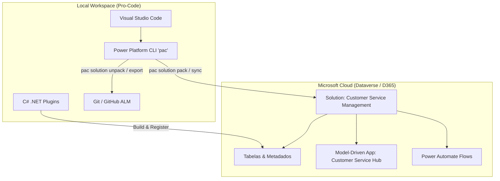
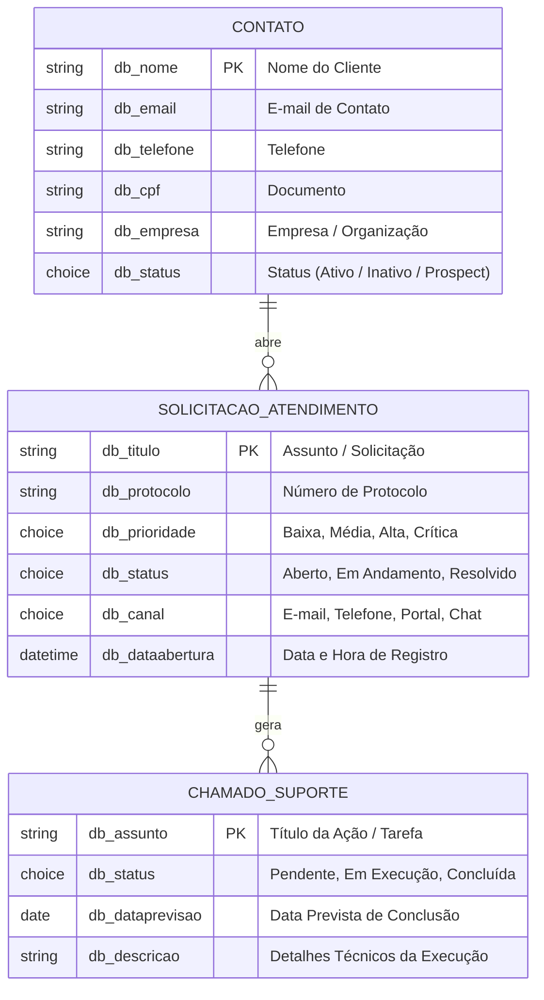

# 🎯 Customer Service Management — Power Platform & Dynamics 365

[](https://powerapps.microsoft.com/)
[](https://learn.microsoft.com/power-apps/maker/data-platform/)
[](https://dotnet.microsoft.com/)
[](https://learn.microsoft.com/power-platform/developer/cli/introduction)
[]()

Projeto de demonstração e portfólio corporativo desenvolvido com a abordagem **Fusion Development**, unindo recursos Low-Code da **Microsoft Power Platform** com desenvolvimento Pro-Code em **C# .NET, Power Platform CLI (`pac`)** e controle de versão profissional via **Git/GitHub**.

---

## 🏛️ Arquitetura da Solução (Fusion Development)

A solução combina a agilidade das ferramentas visuais para modelagem e interface com a robustez e rastreabilidade do código-fonte gerenciado via VS Code e Git:



---

## 🗄️ Modelo de Dados (Dataverse)

As entidades foram criadas dentro da solução gerenciável com o prefixo **`db_`** (Publisher: **Daniel Barbieri**):



---

## 📂 Estrutura do Repositório

```text
c:\PowerApps\
├── .gitignore                          # Exclusões de arquivos de build e binários
├── README.md                           # Documentação técnica do projeto
├── dados/                              # Datasets para demonstração e importação
│   ├── CustomerServiceData.xlsx        # Planilha com abas formatadas para testes
│   ├── clientes.csv                    # Carga inicial de Contatos / Clientes
│   ├── atendimentos.csv                # Carga inicial de Solicitações
│   └── tarefas.csv                     # Carga inicial de Tarefas / Chamados
├── solutions/                          # Pacotes de solução da Power Platform
│   ├── CustomerServiceManagement.zip   # Arquivo exportado da solução Dataverse
│   └── CustomerServiceManagement/      # Solução desempacotada (Source-controlled)
│       ├── CustomerServiceManagement.cdsproj
│       └── src/
│           ├── Other/                  # Solution.xml, Customizations.xml
│           ├── Entities/               # Metadados das tabelas (XML)
│           │   ├── db_contato/
│           │   ├── db_solicitacaodeatendimento/
│           │   └── db_chamadodesuporte/
│           ├── AppModules/             # Definição do Model-Driven App
│           ├── AppModuleSiteMaps/      # Mapa do site e menu de navegação
│           └── Workflows/              # Definição dos fluxos Power Automate (JSON/XML)
├── src/                                # Código-fonte de extensibilidade
│   └── plugins/                        # Projetos C# .NET de Plugins Dataverse
└── tools/                              # Scripts utilitários de provisionamento e carga
    └── generate_import_files.py
```

---

## ⚙️ Guia de Uso e Comandos da CLI (`pac`)

### 1. Verificar Autenticação e Ambientes
```bash
# Listar perfis de autenticação configurados
pac auth list

# Detalhes da organização ativa
pac env who
```

### 2. Exportar e Desempacotar Solução (Sync para o Git)
```bash
# Exportar solução não-gerenciada do Dataverse
pac solution export --name CustomerServiceManagement --path solutions/CustomerServiceManagement.zip --overwrite

# Desempacotar arquivos XML para versionamento no Git
pac solution unpack --zipfile solutions/CustomerServiceManagement.zip --folder solutions/CustomerServiceManagement/src
```

### 3. Empacotar e Importar (Deploy de Mudanças)
```bash
# Empacotar código-fonte em arquivo .zip
pac solution pack --zipfile solutions/CustomerServiceManagement_deploy.zip --folder solutions/CustomerServiceManagement/src

# Importar para o ambiente de destino
pac solution import --path solutions/CustomerServiceManagement_deploy.zip
```

---

## 🚀 Fases do Projeto

- [x] **Fase 1:** Configuração do ambiente local, instalação da CLI `pac`, extensão VS Code e autenticação.
- [x] **Fase 2:** Criação da Solution `CustomerServiceManagement`, Publisher `Daniel Barbieri` (`db_`) e tabelas no Dataverse.
- [x] **Fase 3:** Construção do **Model-Driven App** (*Customer Service Hub*), views e formulários customizados.
- [x] **Fase 4:** Desenvolvimento de Plugin C# .NET para regra de negócio (geração e validação de protocolos).
- [x] **Fase 5:** Automação de processos com Power Automate (notificação automática de novos chamados).
- [ ] **Fase 6:** Pipeline de ALM com GitHub Actions.

---

## 👤 Autor
**Daniel Barbieri**  
*Desenvolvimento de Software, Cloud & Power Platform Solutions*
